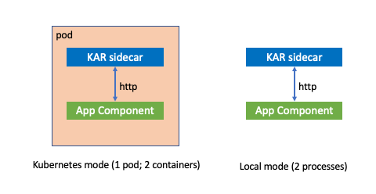
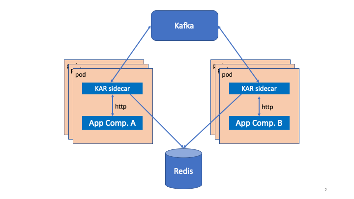

# KAR: Kubernetes Application Runtime

The KAR project is part of a strategic effort in IBM Research to
simplify cloud native development and drive the growth of IBM's Hybrid
Cloud strategy. KAR, an acronym for *Kubernetes Application Runtime*,
is specifically about developing a programming model and supporting
runtime system that directly supports a productive programming model
for assembling enterprise applications from cloud-native components.

If you are a regular employee in the Research Division, you can access
our [Challenge Portal Entry](https://aichallenges.sl.cloud9.ibm.com/challenges/2659?tab=details)
for additional strategic context.  For non-Research employees, the
[Project Summary](#project-summary) below captures the technical
overview from the Challenge Portal Entry.

## Quick Links

+ See [Getting Started](docs/getting-started.md) for hands-on instructions on trying KAR.
+ See [KAR on IBM Cloud](docs/kar-ibmcloud.md) for notes on using KAR with the IBM Cloud.
+ Check out our [examples](examples/README.md)
+ Read about the KAR [Programming Model](#programming-model)
+ Browse the Swagger specification of the [KAR sidecar API](https://pages.github.ibm.com/solsa/kar/api/redoc/).

## Project Summary

### Motivation

Cloud platforms provide developers with a multitude of building
blocks: compute engines to execute containerized microservices and
serverless functions; access to multiple data stores; pub/sub and
messaging services; and a diverse set of other platform-managed
services. However, productively assembling these building blocks into
an overall solution that achieves the desired application-level
(global) characteristics of availability, reliability, scalability,
transactionality, etc. remains an extremely challenging task that
requires a high degree of technical expertise and cross-stack
knowledge. Furthermore, there is a lack of repeatable methodologies,
best practices, and associated middleware for assembling a complex
enterprise application using cloud-native building blocks. These gaps
impede the adoption of hybrid cloud technology by enterprise clients.

There are many established and successful programming models for
building individual microservices in specific programming languages
(e.g. Spring for Java, Express for NodeJS). These models are adequate
for building individual application components, but by themselves are
not sufficient to enable enterprises to construct complete
applications with the necessary global characteristics.

Based on our understanding of the desired application patterns and the
capabilities of the underlying building blocks, we intend to develop
an application runtime system called KAR that directly supports a
productive programming model for assembling enterprise applications
from cloud-native components. In particular, we propose to build a
system with **strong enough failure semantics** and **built-in support
for state** to significantly simplify the construction of reliable,
stateful applications. We will both build out the middleware layer and
develop motivating example applications and application patterns that
illustrate its usefulness.

We believe that a cloud-native programming model should abstract away
non-essential details of the runtime system and the components being
assembled to enable the **decoupling of the logical application
architecture from the specific technology choices** that are made to
(a) develop each component and (b) deploy an application instance in a
specific environment.

### Key Assumptions
+ We assume Kubernetes (OpenShift) as our base distributed operating system.
+ We assume Kafka as a reliable messaging platform.
+ We assume a persistent data store.
+ We assume that a variety of programming languages/models will be
  used to construct the individual application components that contain
  business logic. We do not assume that these components can be
  entirely oblivious of the overarching programming model we are
  providing, but using our programming model/runtime will not require
  deep changes to the existing technology/languages used to implement
  business the core business logic.

### Technical Approach

We will inject a level of indirection/abstraction between individual
application components by introducing a "standard" set of **REST-style
APIs for accessing pub/sub, data store, compute engines, and other
services**. Applications use these APIs to access the logical services
they need. For selected programming languages, a thin
language-specific SDK can provide a more idiomatic set of APIs than
the least-common-denominator REST API.

When an application instance is deployed, a **sidecar** attached to
each application component implements the REST-style APIs and mediates
all incoming and outgoing traffic from the component. The runtime
system consisting of all the sidecars and possibly other helper
services leverages **Kafka to ensure reliable at-least-once delivery
semantics** of all messages, freeing individual application components
from having to deal with transient failures.

As a programming abstraction, **synchronous RPCs** are generally
easier for programmers to use correctly that asynchronous
APIs. However, synchronous invocation of high-latency services is
undesirable for a number of reasons (performance/footprint;
fault-tolerance; resource allocation/migration). We hypothesize that
an important role for the programming model is to provide the
programmer with the illusion of synchronous cross-component APIs while
actually implementing those APIs via lower-level asynchronous
operations with more desirable performance and reliability
characteristics.

In order to facilitate the development of scalable, stateful
applications, we propose to initially focus on supporting three kinds
of application components:
+ **Stateless components** whose scaling can be primarily managed
  using Kubernetes mechanisms (or KEDA).
+ **Stateful components** that are managed by the application itself
  (in particular singleton services).
+ **Virtual stateful components** (aka actors or agents) whose
  scaling and migration can be completely managed by our runtime layer
  because the runtime layer is able to activate, passivate, and migrate
  agent instances between containers.

While we intend to leverage Kubernetes to the fullest extend
(discovery, routing, scaling, health...), we believe a good local
developer experience is essential to success. Our sidecar can run
outside of Kubernetes with low resource requirements, making it
possible for a developer to run one or multiple application components
locally, e.g. on a laptop.

## Programming Model

An application is composed of multiple components. Every instance of
an application component is paired with its own KAR runtime _sidecar_
process that mediates all of the component's inter-component
interactions. From the perspective of the application, all
inter-component interactions occur via RESTful calls to its sidecar as
depicted below. The pair of a single application process and single
sidecar process is the basic building block of a KAR application and
the unit of [fault-tolerance](#fault-tolerance).

The picture below represents the runtime structure of a KAR
application with two replicated application components, **A** and
**B**. Each instance of the application relies on local communication
with its sidecar to handle service discovery, cross-component calls,
etc. Beneath the hood, the KAR sidecars orchestrate all
inter-component interactions using reliable messaging on Kafka to
provide the application with at-least-once delivery semantics. The
sidecars also mediate application access to Redis, providing a
persistent key-value store.

### Services

An application component can expose one or more logical services to
other components. Each service can contain an arbitrary set of REST
endpoints that can be invoked either synchronously or
asynchronously. Application components that provide services are
intended to be auto-scaled by KAR/Kubernetes and therefore should
either be stateless or do their own state management. 

### Actors

KAR includes a virtual actor model that provides system-managed
stateful entities. An application component can host one or more actor
types.  The entire actor life cycle and auto-scaling of application
components that are hosting actors is managed by the KAR runtime.

### State

KAR provides applications with a resilient key-value store to store
arbitrary application state.

### Event Sources and Sinks

KAR provides applications with a publish/subscribe sub-system that can
be bound to a variety of concrete event sources and sinks.

### Fault Tolerance

The containment domain for failures in KAR is the basic unit of a
single application process and its sidecar. KAR provides at-least-once
semantics for all inter-component interactions.  Once an
inter-component message has been accepted by a KAR sidecar
it is guaranteed to be delivered to an instance of the target
application component. In the presence of failures, some messages may
be delivered more than once to different instances of the component.
