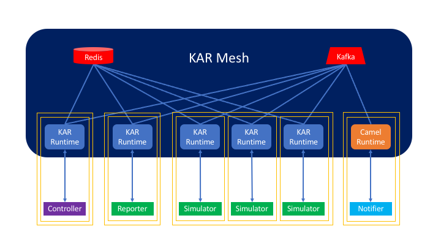

# KAR: A Runtime for the Hybrid Cloud

The KAR runtime makes it easy to _develop_ and _run_ stateful, scalable,
resilient applications for the _hybrid cloud_ that combine microservices and
managed services.

KAR is:
- open source and vendor neutral.
- cloud-native: KAR is built for Kubernetes and OpenShift.
- polyglot: KAR supports any programming language and developer framework by
  means of REST APIs. Idiomatic SDKs for specific languages may be developed
  with minor effort.
- simple yet expressive: KAR interfaces stateless and stateful microservices
  using requests and events.
- scalable: KAR is designed from the ground up to handle dynamic scaling of
  replicated stateless and stateful microservices.
- resilient: KAR combines persistent message queues with persistent data stores
  to offer strong fault-tolerance guarantees.
- extensible: KAR applications can produce or consume events and data streams
  using hundreds of [Apache Camel](https://camel.apache.org) sources and sinks.

KAR is deployed as a lightweight process, a container, or a Kubernetes sidecar
that runs alongside each microservice:
- The KAR process exposes a REST API to the microservice. Using this API, the
  microservice can make synchronous and asynchronous requests to other
  microservices, produce or consume events, or manage its persistent state.
- This REST API is served over HTTP/1.1 for maximal compatibility as well as
  HTTP/2 for high performance and scalability.

Together the KAR processes form a mesh:
- This mesh can run entirely on a developer's laptop, or entirely within a single Kubernetes cluster,
  or spanning multiple clusters, servers, VMs, edge devices, etc.
- This mesh leverages Kafka to decouple the microservices from one another and
  guarantee reliable request/response and publish/subscribe interactions.
- This mesh has no leader, no single point of failure, and no external dependency other than
  a Kafka and Redis instances.

Using the KAR mesh, a typical application interfaces a collection of
microservices, event sources, event sinks, and interactive client/CLI processes.
Consider for instance the architecture of the simulation engine described in
[actor-ykt](examples/actors-ykt/README.md). This application combines:
- a replicated simulator microservice that can be scaled to accommodate many
  simulated agents.
- a singleton reporter microservice that produces reports on a schedule or on
  demand.
- a controller that runs only when a human operator is controlling the
  simulator.
- a notifier that sends reports to a Slack channel.

The simulator, reporter, and controller are Node.js components implemented in
JavaScript. The notifier component leverages the Camel runtime and is configured
by means of a few lines of YAML.

A developer may choose to deploy the simulator to Kubernetes/OpenShift but run
the controller on his laptop. The KAR CLI or operator automatically injects and
configures the KAR runtime that runs alongside each component.

# Scalable and Fault-Tolerant State

KAR puts a great deal of emphasis on helping developers manage application
state. Stateless microservices are easy to scale and easy to restart or replace
on failure. Stateful microservices are not. Moreover the state of an application
not only includes the state of its microservice components, but also the state
of in-flight requests or events, external state in databases or on disk, etc.
Keeping track of this state, avoiding performance bottlenecks, and protecting it
from failures is typically very hard.

## Actors

KAR make it easy to structure the state of microservices as a collection of
_actor_ instances. The [actor model](https://en.wikipedia.org/wiki/Actor_model)
is a popular and well-understood approach to programming concurrent and
distributed systems. Each actor instance is responsible for its own state. The
state of an actor instance can be saved or restored safely (because actor
instances are single-threaded) and independently from other actor instances
(since there is no shared state).

KAR offers simple APIs for actors to incrementally save their state to Redis.
These APIs can be triggered periodically, or when idle with little effort. KAR
can automatically restore the state of a failed actor instance. Timers or event
subscriptions associated with an actor instance are also restored.

Actor instances can migrate from one microservice replica to another due to
failures or for load balancing purposes. KAR understands that actors are
relocatable. KAR's API for invoking actors transparently routes, and if necessary
reroutes, requests to the proper destination.

For instance, in the simulation engine example, the simulation state is
partitioned across multiple replicas of the simulator microservice using actors.
A developer can reason about and program these actors and their interactions
without having to worry about exhausting the resources of a single process or
mapping actor instances to processes. In that sense, KAR supports a "serverless"
experience.

## Exactly-once completion semantics

KAR not only facilitate persisting the state of actors, but it also
transparently persists requests and events until fully processed. More
precisely, KAR combines three guarantees:
- an _at-least-once-delivery_ guarantee,
- an _at-most-one-attempt-at-a-time_ guarantee,
- a _no-reexecution-upon-success_ guarantee.

In other words, KAR will try as many times as necessary, making one attempt
after the other, but not once more than necessary.

KAR strives to achieve such guarantees in a dynamic, distributed system with
minimal overheads.

# Quick Links

+ See [Getting Started](docs/getting-started.md) for hands-on instructions on
  trying KAR.
+ See [KAR on IBM Cloud](docs/kar-ibmcloud.md) for notes on using KAR with the
  IBM Cloud.
+ Check out our [examples](examples/README.md).
+ Read about the KAR [Programming Model](docs/KAR.md).
+ Browse the Swagger specification of the [KAR
  API](https://pages.github.ibm.com/solsa/kar/api/redoc/).

# License

KAR is an open-source project with an [Apache 2.0 license](LICENSE.txt).
