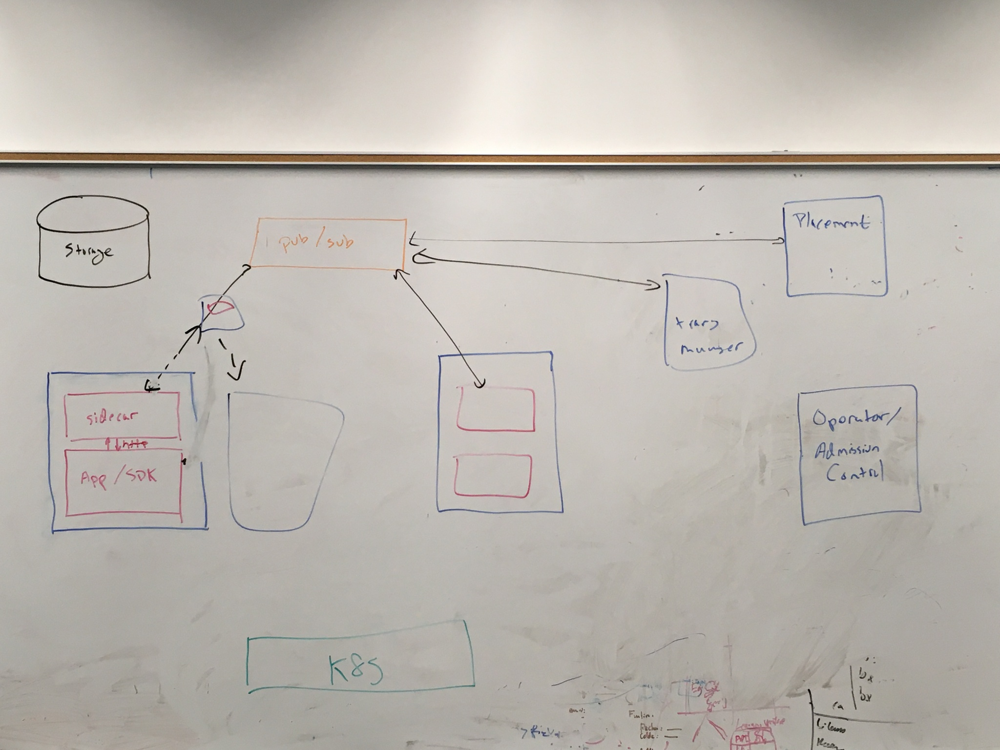

<!--
# Copyright IBM Corporation 2020,2021
#
# Licensed under the Apache License, Version 2.0 (the "License");
# you may not use this file except in compliance with the License.
# You may obtain a copy of the License at
#
#     http://www.apache.org/licenses/LICENSE-2.0
#
# Unless required by applicable law or agreed to in writing, software
# distributed under the License is distributed on an "AS IS" BASIS,
# WITHOUT WARRANTIES OR CONDITIONS OF ANY KIND, either express or implied.
# See the License for the specific language governing permissions and
# limitations under the License.
-->

## Architectural block diagram

+ A blue box (App Container + sidecar) is the containment domain for a
failure. In other words, if either the App or the sidecar fails, the
entire unit will be considered failed and potentially
restarted/replaced.

+ Within a containment domain, the App & sidecar can communicate
directly via synchronous http.

+ Across containment domains, communication is by default reliable and
mediated via a pub/sub system that provides at-least-once semantics.
App components communicate with each other via their sidecars
(App1 -> sidecar -> pub/sub -> sidecar -> App2)

+ There are three broad classes of application components that are
"inside" the system (have sidecars)

    1. Stateless components whose scaling can be primarily managed
    outside of our runtime layer (eg delegated to Kubernetes HPA or
    KEDA).
    
    2. Stateful components whose scaling will be primarily managed by
    our runtime layer and requiring App cooperation to scale up or
    down. Cooperation on scaling operation is needed because the App
    is primarily responsible for state management.

    3. Virtual stateful components (aka actors or agents) whose
    scaling and migration can be completely managed by our runtime
    layer because the runtime layer is able to activate, passivate,
    and migrate agent instances between containers.

+ The programming model supports external State. Apps perform
operations on external State via APIs provided by their sidecars (App
-> sidecar -> State). Multiple abstract consistency models are
supported.

+ The system providers a transaction manager.  App components
communicate with the transaction manager via APIS provided by their
sidecar, mediated by the pub/sub layer
(App -> sidecar -> pub/sub ->TM; TM -> pub/sub -> sidecar -> App)

+ We should build on top of Kubernetes capabilities and avoid
duplication functions.  For example, we should build on
StatefulSets/Deployments for container management and for
liveness/readiness.  Basic service discovery (and simple load
balancing?) can be provided by Kubernetes Services (or potentially at
a higher level by a service mesh).

+ We can build on top of Kafka's mechanism of assigning the partitions
of topics to members of a consumer group to implement agent
placement. Especially with the introduction of co-operative
rebalancing of consumer groups in Kafka 2.4, it seems like there is a
plausible implementation is to create k-times as many partitions of the
"Agent-Type-A" topic as the maximum desired replica count for pods
providing "Agent-Type-A" and let Kafka route for us.

## Questions to answer

+ How best to integrate pub/sub (topic names) with logical/physical
blue boxes (pods).  For App components realized as StatefulSets, the
mapping seems clear: 1 topic per stable pod name (app-0, app-1, etc).
For "stateless" components, the mapping is less clear because we need
to get a better understanding of the more complex consumer
configurations possible in Kafka and their implications for
at-least-once delivery semantics and overall scalability/performance.

+ To what extent can we allow a single blue box to contain more than
one class of application component?

+ There may be scenarios where we need to separate control plane
(reliable, at-least-once) from data plane (bulk transfer of large data
objects) traffic.  This seems likely to get messy in the presence of
failure or other kinds of migration.  Do we really need this
separation? If we do need it, how can we surface it in the programming
model in a usable set of abstractions?
