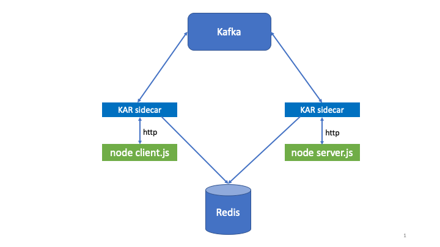

# Prerequisites

1. You need a Kubernetes 1.16 (or newer) cluster.
    1. You can use [kind](https://kind.sigs.k8s.io/) to create a virtual
       Kubernetes cluster using Docker on your development machine. Once
       you have Docker installed, just run
       [start-kind.sh](../build/ci/start-kind.sh) to create a virtual cluster.
    2. You can use an IKS cluster provisioned on the IBM Public Cloud.

2. You will need the `kubectl` cli installed locally.

3. You will need the `helm` (Helm 3) cli installed locally.

# Getting Started with KAR

In the sections below, the sample commands are meant to be executed in
the top level directory of a local git clone of this repository. Get
one by doing:
```script
git clone git@github.ibm.com:solsa/kar.git
cd kar
```

## Deploying KAR to the `kar-system` namespace

You can deploy KAR using pre-built images from KAR project namespaces
in the IBM container registry (kar-dev, kar-stage,
kar-prod). Currently, you will have to ask Dave or Olivier for an
apikey to access this namespace.  Use the apikey as an argument to
`kar-deploy.sh`:
```script
./scripts/kar-deploy.sh -a <KAR_CR_APIKEY>
```

Alternatively, you can deploy in dev mode where KAR will use
locally built images for all KAR runtime components and examples.
Since it is bypassing the container registry, this mode is preferred
for local development, but only works with `kind`, not IKS.
Deploy KAR in dev mode by doing:
```shell
make kindPushDev
./scripts/kar-deploy.sh -dev
```

## Enable a namespace to run KAR-based applications.

**NOTE: We strongly recommend against enabling the `kar-system` namespace
  or any Kubernetes system namespace for KAR applications. Enabling
  KAR sidecar injection for these namespaces can cause instability.**

Enabling a namespace for deploying KAR-based applications requires
copying configuration secrets from the `kar-system` namespace and
labeling the namespace to enable KAR sidecar injection.  These steps
are automated by
[kar-enable-namespace.sh](../scripts/kar-enable-namespace.sh)

For example, to create and KAR-enable the `kar-apps` namespace execute:
```shell
./scripts/kar-enable-namespace.sh kar-apps
```

Or to KAR-enable an existing namespace, for example the `default`namespace:
```shell
./scripts/kar-enable-namespace.sh default
```

Now you are ready to run KAR applications!

## Running KAR-based applications

To demonstrate the different modes of running KAR applications, we'll
use a simple greeting server.  A server process receives a request
from a client containing a name and responds to each request with a
greeting. The picture below depicts the structure of this application;
_green_ components represent the application code and _blue_ components
are KAR system components.




### Mode 1: running completely inside Kubernetes

In this mode, the application runs in Pods in a Kubernetes cluster in
a KAR-enabled namespace.  The KAR runtime is automatically injected as
a sidecar container into every application Pod.

If you have not already built and pushed images to your kind cluster,
execute `make kindPushDev`.

Next run the client and server as shown below:
```shell
$ cd examples/helloWorld
$ kubectl apply -f deploy/server.yaml
pod/hello-server created
$ kubectl get pods
NAME           READY   STATUS    RESTARTS   AGE
hello-server   2/2     Running   0          3s
$ kubectl apply -f deploy/client.yaml
job.batch/hello-client created
$ kubectl logs jobs/hello-client -c client
Hello John Doe!
$ kubectl logs hello-server -c server
Hello John Doe!
$ kubectl delete -f deploy/client.yaml
job.batch "hello-client" deleted
$ kubectl delete -f deploy/server.yaml
pod "hello-server" deleted
```

### Mode 2: running completely locally

In this mode, both the KAR runtime and the application run
as processes on your local machine.  The KAR runtime dependencies
(Kafka and Redis) are assumed to be already running and are made
available to KAR by defining environment variables.  The simplest way
to deploy and configure these dependencies is to deploy KAR to a
`kind` cluster and then source
[kar-kind-env.sh](../scripts/kar-kind-env.sh) to configure your
command shell to enable access to them.

You will need to build the `kar` binary locally.  This requires a
correctly configured Go development environment on your machine. In
your top-level directory execute:
```shell
go install ./...
```
You should now have the `kar` executable in your path.

In one window:
```shell
. scripts/kar-kind-env.sh
cd examples/helloWorld
npm install
kar -app helloWorld -service greeter node server.js
```

In a second window:
```shell
. scripts/kar-kind-env.sh
cd examples/helloWorld
kar -app helloWorld -service client node client.js
```

You should see output like shown below in both windows:
```
2020/04/02 17:41:23 [STDOUT] Hello John Doe!
```
The client process will exit, while the server remains running. You
can send another request, or exit the server with a Control-C.

### Mode 3: run the server in Kubernetes and the client locally

You can also run in a hybrid mode where some parts of your application
run locally and others run inside the cluster.  KAR will automatically
connect the pieces of your application via Kafka to each other.
For example, run the server in the cluster and the client locally.

```shell
$ kubectl apply -f deploy/server.yaml
pod/hello-server created
$ kar -app helloWorld -service client node client.js
2020/04/02 18:02:19 [STDOUT] Hello John Doe!
$ kubectl delete -f deploy/server.yaml
pod "hello-server" deleted
```
